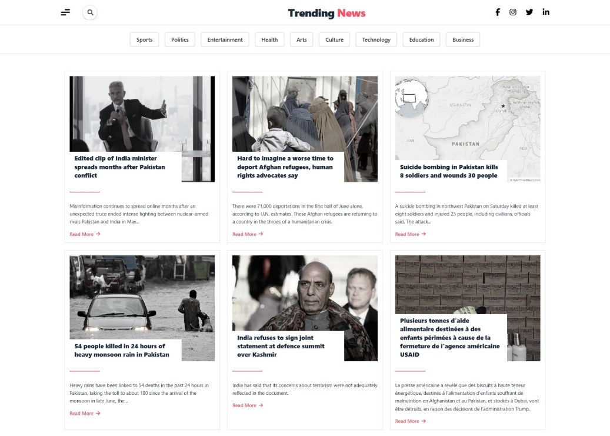
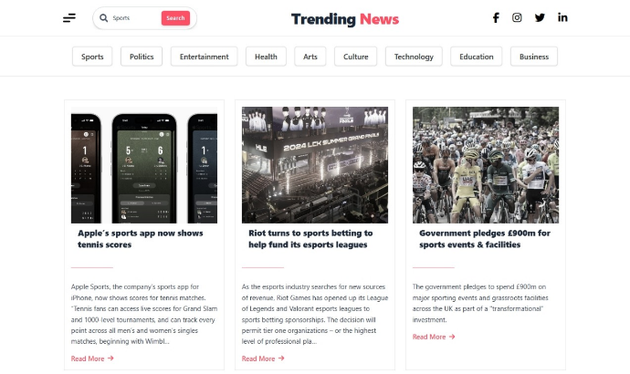

#  News Website - API Based Project

This is a modern, responsive news website built with **React + Vite**, styled using **Tailwind CSS**, and powered by the [NewsAPI.org](https://newsapi.org/) to fetch real-time news articles. The app features dynamic search, category filtering, and a smooth user experience across all devices.

---

##  Features

-  Real-time News Search  
-  Category Buttons (Sports, Technology, Politics, etc.)  
-  Fully Responsive Design  
-  Styled with Tailwind CSS  
-  Built with Vite for Fast Development  
-  API Integration with [NewsAPI](https://newsapi.org/)  
-  Clean, modular React components  
-  Error handling for empty or missing data  
-  Scroll-to-top button functionality  

---

#  Tech Stack

- **React** – Component-based UI  
- **Vite** – Lightning-fast frontend tooling  
- **Tailwind CSS** – Utility-first styling  
- **NewsAPI** – Fetching up-to-date news  
- **Font Awesome** – Social and UI icons  

---

##  Folder Structure

```text
src/
│
├── components/              # Reusable UI components
│   ├── Card.jsx             # Displays each news card
│   ├── Menubar.jsx          # Sidebar with category filters
│   ├── SearchBar.jsx        # Search input box
│   ├── ScrollTopButton.jsx  # Scroll to top button
│   ├── MobileMenuBar.jsx    # Navbar for mobile view
│
├── Newsapp.jsx              # Main logic for fetching and rendering news
└── App.jsx                  # Entry point of the React app
```
##  Getting Started

### 1. Clone the Repository

```bash
git clone https://github.com/saeedasaad/news-website.git
cd news-website
```

### 2. Install Dependencies

```bash
npm install
```
### 3. Setup NewsAPI Key

```bash
VITE_NEWS_API_KEY=a5a031962299402299d659e0493f56a1

```
### 4. Run the App

```bash
npm run dev
```

## Screenshots

<h3> Home Page</h3>


<h3> Search Results</h3>


<h3> Mobile View</h3>


## Environment Variables

Key	Description
VITE_NEWS_API_KEY	a5a031962299402299d659e0493f56a1

## Future Improvements
-Add pagination or infinite scroll
-Integrate a dark/light mode toggle
-Add localization support
-Add loading spinner or skeletons

##License

This project is licensed under the MIT License.

## Acknowledgements
NewsAPI.org

-Vite
-Tailwind CSS
-Font Awesome

🔗 **[Live Demo](https://saeedasaad.github.io/news-website-API/)**

---
